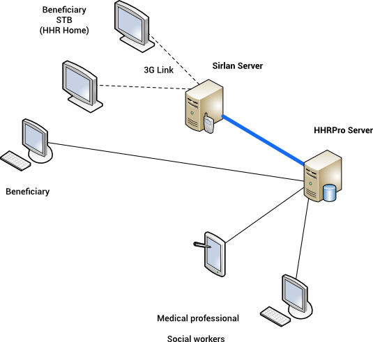

% Queue Service
% Fabrice Le Coz
% Janauary, 2015

# Queue service

The PhysioDOM Queue service is used to push messages from HHR-Pro instances to SServer.

The SServer is a gateway done by SIRLAN, that pilots Set Top boxes through 3G connections

## installation

### prepare the config file

You need to provide a config file named `queue.json`, this file is shared with the
docker instance by sharing a volume

    {
      "mongouri": "mongodb://mongo/physioDOM_queue",       <-- url of the database
      "server":   "http://127.0.0.1:8443",                 <-- url of the SServer
      "key":      "D9C7F19C-7588-4C39-91BB-FBFEFE1BE90A",  
      "appSri":   "plt.treedb.srv/web",                    <-- application key on the SServer
      "retry":    5                                        <-- retry time in minutes before resending a message
    }

### running

    docker pull physiodom/queue
    # You will also need an etcd instance and a mongodb instance
    docker pull physiodom/etcd
    docker pull mongo:3.2
    
    # run the etcd instance
    docker run -d \
        --name etcd \
        -v /opt/data/etcd:/data \
        physiodom/etcd
    docker run -d \
          --name mongo \
          -v /opt/data/mongo:/data/db \
          mongo:3.2 \
          --smallfiles
    # run the queue instance
    docker run -d --name queue -h queue \
           -p 9000:9000 \
           --link mongo:mongo \
           --link etcd:etcd
           -v /home/config/queue:/config \
           -v /home/logs/queue:/logs \
           physiodom/queue:x.y.z